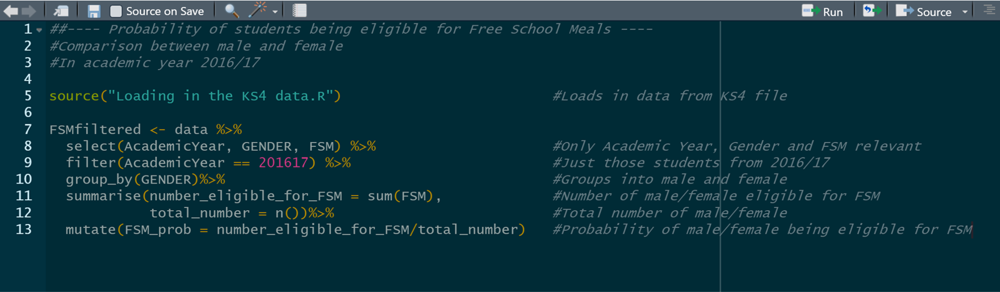

# Tips for coding

## What you __should__ do

QAing code can be a difficult job. Doing the following things will help others to QA your code.

* Annotate, always annotate!
  + You should explain what each step of the code does and why. It can be very difficult to understand someone else's code.
  + It is much harder to QA someone else's code if you also have to work out what each step is meant to be doing. Making each step clearer not only helps them to QA your code properly, it will also save them time.
  + It is much easier to annotate code as you go along rather than come back to it later. Annotating code can be a pain, but once you are in the routine of annotating as you write, you will find that it quickly becomes second nature.
  

* Keep analysis and the code used to produce it together.
  + Pasting code into Excel workbooks can be a useful way to link code and data together. This makes future updates much easier too.
 
* Self QA your code
  + The best way to QA code is through self QA, producing output tables to physically examine/check the data produced by each step.
  + For example, has a merge/join done what you wanted it to? Has the number of records in your dataset increased? Have the correct variables been added in? What had happened to those records that are missing variables/values? Are there duplicates?
  + Never assume on blind faith that data has been processed as you wanted it to be. The merge you asked the computer to do might not be the merge that the computer actually did...

* Think about how QAers will approach your code.
  + Can they understand what you have done?
  + Is the process logical? Does it make sense? Should it be done in a different way?
  + Are records with missing data being handled right?
  + Have the correct checks been undertaken to reassure the QAer that the accuracy of analysis/data processing has been tested?
  + The QAer should also check the data itself, and undertake or suggest tests that can help prove whether the data is right.
 
## What you __could__ do

The following tips might not be appropriate for every code you write, but if you can do these things too, you'll help not only yourself, but your QAer as well!

* Have a 'super library' of code that you use/create that you can refer back to.

* Where possible, cannibalise existing code rather than produce code from scratch.

* Use shortcuts, e.g. have the year/subject defined at the top of the code rather than throughout.

* Run on a small sample first. It is good practice to run your code on less than 1000 observations to check that there are no simple errors. It is not worth running a huge piece of code on a million records for 20 minutes to get a message saying 'ERROR:- missing semi colon'.

* Build in checks as you go along. For example, you have 1 million records for teachers, and you merge in 1 million records on the favourite colours of those teachers. Have you still only got 1 millions teachers in your dataset?
  + When performing merges, check that everything has gone smoothly by running off some quick output tables. Spot checks can also help here, e.g. take a sample of 5 teachers and check that their data merged correctly.

## QA of models

QAing models can be a big job, particularly when the model is quite large and pulls in data from a variety of datasets. Here are a few things to bear in mind to assist QAers in their job. All of these checks are QA and build faith in a model being right.

* Building in auto checks can be a great way to make QA easier. Lots of charts of outputs are also very helpful.

* As with syntax, make sure that you annotate! What is each step of the model doing and why?
  + Always explain what assumptions have been made and why. What is the evidence behind making these assumptions?
  + Big models should have an assumptions log or a guide explaining *why* the model works the way it does. For example, *why* have you assumed in your analysis that 5% of teachers in future will be leaders?
 
* All the input data should come into the model from one place within the model if possible.

* When QAing a model, QA should focus most strongly on things that have changed or been added in. Otherwise, the normal QA procedures apply.

* Many models are updated regularly, usually on an annual basis. Outputs will vary from year to year. One of the most effective forms of QA for models is to investigate *how* output values change between versions of the model and discover what might be driving that. This can be done by testing the impact of and comparing input data values and assumptions between years and versions.

* Scenario testing can be undertaken to examine how sensitive the model outputs are to different data to examine what drives the model.