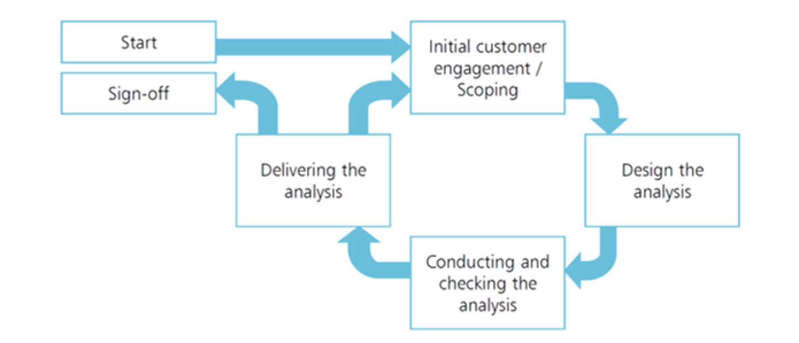

--- 
title: "How to quality assure"
author:
 - Department for Education guidance
 - The first version of this guidance was written by Thomas Morley, with help from Melissa Cook, James McGlade and Nicky Brassington. It is intended to be a living document and we'd very much welcome suggestions for improvements or additions. Please contact the Modelling Improvement and Assurance Unit. Suggestions will be reviewed by the DfE QA team, and any approved changes will be made.
date: "`r Sys.Date()`"
site: bookdown::bookdown_site
favicon: pictures/qa_logo.png
---

# Introduction

Whenever we produce a new model or a new piece of analysis, it is important to quality assure (QA) our work. This allows us to check that our analysis is credible and provides assurance to senior leaders that modelling risks are being managed appropriately.

The principles of good QA are outlined in the DfE QA framework (which can be found [here](https://educationgovuk.sharepoint.com/:w:/r/sites/sarpi/g/_layouts/15/Doc.aspx?sourcedoc=%7BE1DED116-2A85-4754-993F-A6E458DA3A59%7D&file=Quality%20Assurance%20of%20Models%20at%20DfE_April_2020.docx&action=default&mobileredirect=true)). The QA framework sets out a list of rules that one must abide by when QAing a piece of work, yet provides very few examples.

<center>


</center>

The purpose of this documentation is to provide extra examples that support the QA framework. It is important to ensure not just that our work is QA'd, but that it is QA'd **well**. The aim of this documentation is to provide guidance on how to ensure that the QA being carried out is being done properly in order to provide an accurate picture of the reliability of analysis. It is aimed at both quality assurers (teaching a QAer how to properly QA a piece of work) and at original code/model authors (teaching an analyst best practice that will allow a piece of work to be QA'd easily).

By necessity, this guidance isn't comprehensive. QA takes different forms depending on the work that is being carried out. If you are still unsure on how to carry out good QA in your area, contact your [QA officer](https://educationgovuk.sharepoint.com/sites/sarpi/g/SitePages/QA-Officers'N.aspx)).

Before discussing 'good' QA, it is useful to think about what it means for QA to be 'bad'.

## What does 'bad' QA look like?

<center>


</center>

There are many examples where QA is not up to scratch despite following the QA guidance. Here are a few of these examples:

* The QA is rushed at the last minute. This could be due to the urgency of the project, or pressure from senior leaders or clients, but this can lead to mistakes in the QA or 'cutting corners'. Always ensure that an appropriate amount of time is allocated for QA. This amount of time will often depend on the scale of the project, and the type of analysis that is done.

* Parts of the analysis are *assumed* to be 'right'. Even if results look correct, it is important to properly check the analysis that has been done. Just because something looks 'right' doesn't mean that it is!

* The QAer doesn't ask any 'real' questions about **why** things have been done the way they were.
  + If a QAer says 'everything is perfect' and raises no concerns or doesn't ask any questions at all, this may suggest that they haven't actually undertaken robust QA.
  + Similarly, if someone says that they understand something very complex the first time around, they probably don't understand it. This may be a case of the work being too complex that they struggle to put into words exactly what they don't understand. It may be worth explaining complex pieces of work a couple of times anyway, to ensure that everything has been properly understood.
  + Asking questions can build understanding, and we encourage all QAers to ask questions (even very simple ones!)

* Assuming that things are right because the 'data' or 'the software' says so. Always avoid a 'computer says yes' attitude. Just because a computer doesn't pick up on any errors doesn't mean that the analysis is completely free from mistakes!


* QAers being afraid or nervous about raising concerns. This may be more of a problem when QAing for senior analysts. QA is a vital part of every project, and QAers should be made to feel that they are able to voice concerns whenever they arise. It is important to talk through each of these concerns rather that simply disregarding them.

* Confusion around what QA is needed and what QA has been done. This will be addressed within this document. An up-to-date QA log should be kept at all times to assist with keeping track of QA that has been done, and help highlight where QA is still required. A QA log template is available on the [DfE Quality Assurance page](https://educationgovuk.sharepoint.com/sites/sarpi/g/SitePages/Quality-Assurance.aspx)

<center>


</center>

## What can happen without sufficient QA

In this section, we briefly discuss two examples of where QA wasn't implemented properly, and the effect that this had.

* The InterCity West Coast Rail franchise

In 2012, a franchise competition to see who would continue to run the InterCity West Coast Rail franchise was set up by DfT. However, DfT made fundamental errors in the way it calculated risks for each big. Real and inflated financial figures were mixed up and the spreadsheet contained elements of double counting. This resulted in an unsuitable company being chosen for the franchise.

When faced with accusations from Virgin Trains, who had expected to win the franchise, DfT assured them that their maths was correct. However, when legal action was launched, a more thorough check was conducted, which brought to light the significant errors and cost £8.9m.

As a result of this, £40m was reimbursed to bidding companies and 3 civil servants were suspended. Altogether, this cost the taxpayer almost £50m.

"*Significant risk issues were identified through internal and external quality assurance procedures over the course of the ICWC franchise process*" - House of Commons Liaison Committee.

You can read a news article about the InterCity West Coast Rail franchise [here](https://www.politics.co.uk/news/2013/02/26/complete-lack-of-common-sense-the-disaster-of-the-west-coast-franchise/), and find a Lessons Learned document published by the NAO [here](https://www.nao.org.uk/wp-content/uploads/2012/12/1213796.pdf).

<center>


</center>

* The Teacher Pay Grant Project

Following the publication of the 2018/19 Teacher Pay Grant, DfE quickly discovered that the published allocations were incorrect. 4 year olds had been double counted in the data due to inclusion in both early years and school datasets. This resulted in almost 9,000 schools being allocated a different amount of money than they should have been, and cost roughly £1.1m.

The team had QA in place, but there was still an issue here. Policy kept changing, means that the team had to move quickly and rush to use new data without speaking to experts. When the work changed, they should have gone back to the QA plan and updated it. More time should have been made to allow for sense checks and to allow the team to get a better understanding of the dataset. A combination of significant time pressure and rapidly changing scope led to the team cutting corners, which resulted in these mistakes being made.

You can read a news article about the Teacher Pay Grant project [here](https://www.tes.com/news/schools-receive-more-cash-after-dfe-admits-double-counting-pupils).

<center>


</center>

## What does QA involve?

Here is a chronological list of tasks and activities that should be carried out during a project cycle:

1. Assemble a QA plan and consider how the work will be QA'd. A template for the QA plan is available [here](https://educationgovuk.sharepoint.com/:w:/r/sites/sarpi/g/_layouts/15/Doc.aspx?sourcedoc=%7B09C73885-8C47-4191-9B29-6C34C203723D%7D&file=QA_plan_template.docx&action=default&mobileredirect=true). The QA plan should cover roles and responsibilities, as well as plans for specific activities and documentation. At this stage, it is important to think about who will be doing the QA, and how the work can be QA'd properly.

2. Ensure you are doing the right work. Make sure you are on the same page as the commissioners of the project, and be clear on what questions you are trying to ensure. Question the methodology to make sure you are taking the correct steps. A list of the questions you may wish to ask are given in [Chapter 2][Asking questions].

3. Do the work, and self-QA as you go along. Self-QAing your work will help others to QA your work later on (see [Chapter 3][QAing your own work]). If you are writing code, ensure that you maintain coding standards (see [Chapter 4][Coding]).

4. Have the work QA'd by someone else (see [Chapter 5][Getting QA support from others]). Make sure you've taken all the correct steps to make the QA process as smooth and straightforward as possible. Arrange a meeting to discuss your work with the QAer and make time to answer any questions they may have.

5. Summarise QA and request analytical assurance (if appropriate).

6. Repeat! Every time you go around the analytical cycle, QA must be carried out!



<!--chapter:end:index.Rmd-->

# Asking questions

<center>


</center>

Whenever you get a commission, it is important to always ask the following questions:

* **What do you need?** There is nothing worse than spending days working on something that is not what your customers wanted. A good tip is to provide an example chart or table with dummy data to test their requirements and give them a good idea of how you intend your output to look.

* **Why do you need it?** Customers very often will not know the best way to perform analysis to get the results they are after. Are they requesting something that doesn't really do what they want it to?

* **What will it be used for?** If the model will be used again in the future for slightly different purposes, it may be worth investing extra time in increasing its capabilities.

* **Who will be using it?** This will help you to write the user guides and to think carefully about how outputs are presented.

* **When do you need it by?** Check their diary (especially during the summer months!). People will often say they need things immediately when they don't. Discuss the work and get a clear understanding of why they've set themselves these deadlines. Always factor in time for QA and also time to share analysis with your line manager or team leader.

* **Do we have something already on the shelf?** Why produce new analysis when it has already been done before?

* **Are you going to need this for public use?** Always use published data to answer queries if you can. This data is already QA'd. If you do use public data, try to run things past the relevant team to double check, or at least cc them in. Be very careful about sharing pre-release data before the relevant SFR (Statistical First Release) and TSM (Teacher Supply Model) are published.

If in doubt...

ASK!

It is better to ask someone a question that you might think of as being 'daft' or 'unnecessary' than to not ask it and then make a big mistake. The best person to ask is your line manager and team leader. If they aren't available, then ask your G6 or DD. DDs also like to know if data is being used publically.

For some media queries (and some public queries) for teacher related issues, talk to Press Office.

Think about policy input/views too, especially if you say something about a policy in your response/analysis.

<!--chapter:end:02-questions.Rmd-->

# QAing your own work

## Self QA

<center>


</center>

Before you ask anyone else to QA your work, **you** should QA **your own** work.

There are many examples of self QA that you can use:

* Balance checks. Do percentages add up to 100%?  Do totals add up correctly?

* Sense checks. Do outputs look right or logical?
  + Example: Suppose your analysis tells you that you have a mean average primary school size of 600 pupils across 20,000 schools. This means that you have 12 million primary pupils. Something has clearly gone wrong!
  + Use your common sense, public data and analysis that other analysts have done to sense check your work.
  + If things don't look right, **always** investigate further.
  
* Spot checks. Do some spot checks of formulae, values and calculations. If your spot checks show some errors, it is worth investigating further as these errors may have been replicated elsewhere in the analysis.

Remember, before you ask anyone else to QA your work, you should try to **prove yourself wrong**.

## Odd, funny or unexpected figures

<center>


</center>

If your analysis gives you answers that are unexpected, **investigate them**!

For example, if the Teacher Supply Model (TSM) estimates that every subject needs more Initial Teaching Training (ITT) places this year apart from English, investigate why this is. Is a trend reversing or running counter to expectation? Are values for this year very different to previous years?

It is inevitable that someone senior will ask you about any unexpected results. It is important to understand why your model is giving you such answers, and to put these answers into some context using analysis that has been done previously. If you do not have the answers to these questions prepared, it will give people less faith in you and your work.

Doing these checks will lead you to either find an error, or produce a logical answer to explain this oddity to stakeholders. Either way, it's a win!

If you have calculated the outputs elsewhere (e.g. a separate signed off model), do the outputs match? If you are modifying a simple version of a model for a more specific scenario, the first stage of this update should be ensuring that outputs match those that have been signed off.

Being able to demonstrate that you haven't just taken analysis at face value makes you look good and makes your analysis better! Always ask yourself, when looking at results, what questions are your stakeholders likely to ask? Preparing anaswers for these types of questions is a very important skill for an analyst. You can guarantee that senior stakeholders are most likely to ask about numbers that stick out or look odd...

## Finding errors

<center>


</center>

The best way to find errors, outliers or things that have gone wrong is to use charts. Charts enable quick sense checks and any 'odd' results will stick out like a sore thumb. One of the first things a good QAer will often do is produce some charts.

How about finding a small problem within a big spreadsheet or extensive code? It is useful to always work backwards to find errors. If something looks wrong, work backwards through your spreadsheet or syntax. Look at recent changes and updates. This will enable you to find the place where an oddity first started to appear, and help you to identify the specific problem or cause.

When looking for errors, keep calm and focus on each step of a complex process one piece at a time. If you get flustered or stressed, you will often miss errors, so sometimes it pays to have a drink, take a break or sleep on it. A fresh mind will often be more capable of solving a complex issue.

<center>


</center>

<!--chapter:end:03-selfQA.Rmd-->

# Coding

The aim of this chapter is to summarise the guidance set out in the DfE ['Good Coding Guidance'](https://dfe-analytical-services.github.io/good-code-practice/). Throughout this chapter, you will see sections of the 'Good Coding Guidance' referred to - please see these sections for more information on each of the points raised.

## What you __should__ do

<center>


</center>

QAing code can be a difficult job. Doing the following things will help others to QA your code.

* Annotate, always annotate!
  + You should explain what each step of the code does and why. It can be very difficult to understand someone else's code.
  + It is much harder to QA someone else's code if you also have to work out what each step is meant to be doing. Making each step clearer not only helps them to QA your code properly, it will also save them time.
  + It is much easier to annotate code as you go along rather than come back to it later. Annotating code can be a pain, but once you are in the routine of annotating as you write, you will find that it quickly becomes second nature.
  + See [section 4.1](https://dfe-analytical-services.github.io/good-code-practice/good.html#descriptive-and-informative-comments) of the 'Good Coding Guidance' for more information and examples of annotating code.
  
<center>


</center>

* Keep analysis and the code used to produce it together.
  + Use a folder structure that makes it clear where code is stored and where data is stored.
  + Ensure you have the code on a git version control, with a clear summary of changes that have been made each time the code is committed.
  + For more information on version control, see [chapter 7](https://dfe-analytical-services.github.io/good-code-practice/VC.html) of the 'Good Coding Guidance'.
 
* Self QA your code
  + The best way to QA code is through self QA, producing output tables to physically examine/check the data produced by each step.
  + For example, has a merge/join done what you wanted it to? Has the number of records in your dataset increased? Have the correct variables been added in? What had happened to those records that are missing variables/values? Are there duplicates?
  + Never assume on blind faith that data has been processed as you wanted it to be. The merge you asked the computer to do might not be the merge that the computer actually did...
  + For more information on testing code, please see [chapter 6](https://dfe-analytical-services.github.io/good-code-practice/testing.html) of the 'Good Coding Guidance'.

<center>


</center>

* Think about how QAers will approach your code.
  + Can they understand what you have done?
  + Is the process logical? Does it make sense? Should it be done in a different way?
  + Are records with missing data being handled right?
  + Have the correct checks been undertaken to reassure the QAer that the accuracy of analysis/data processing has been tested?
  + The QAer should also check the data itself, and undertake or suggest tests that can help prove whether the data is right.
 
## What you __could__ do

<center>


</center>

The following tips might not be appropriate for every code you write, but if you can do these things too, you'll help not only yourself, but your QAer as well!

* Have a 'super library' of code that you use/create that you can refer back to.

* Where possible, cannibalise existing code rather than produce code from scratch.

* Use shortcuts, e.g. have the year/subject defined at the top of the code rather than throughout.

* Run on a small sample first. It is good practice to run your code on less than 1000 observations to check that there are no simple errors. It is not worth running a huge piece of code on a million records for 20 minutes to get a message saying 'ERROR:- missing semi colon'.

* Build in checks as you go along. For example, you have 1 million records for teachers, and you merge in 1 million records on the favourite colours of those teachers. Have you still only got 1 millions teachers in your dataset?
  + When performing merges, check that everything has gone smoothly by running off some quick output tables. Spot checks can also help here, e.g. take a sample of 5 teachers and check that their data merged correctly.
  
* A good folder structure can help other users to follow your code, and know where to look for different files. A recommended structure is to have separate folders for 'Data', 'Outputs' and 'Scripts'. Then it is clear exactly what is being fed into the model, and what is being produced by the model.
  
* See [chapter 3](https://dfe-analytical-services.github.io/good-code-practice/fundamentals.html) of the 'Good Coding Guidance' for a more comprehensive list of coding tips.

## QA of models

<center>


</center>

QAing models can be a big job, particularly when the model is quite large and pulls in data from a variety of datasets. Here are a few things to bear in mind to assist QAers in their job. All of these are QA checks and build faith in a model being right.

* Building in auto checks can be a great way to make QA easier. Lots of charts of outputs are also very helpful.

* As with syntax, make sure that you annotate! What is each step of the model doing and why?
  + Always explain what assumptions have been made and why. What is the evidence behind making these assumptions?
  + Big models should have an assumptions log or a guide explaining *why* the model works the way it does. For example, *why* have you assumed in your analysis that 5% of teachers in future will be leaders?
 
* All the input data should come into the model from one place within the model if possible.

* When QAing a model, QA should focus most strongly on things that have changed or been added in. Otherwise, the normal QA procedures apply.

* Many models are updated regularly, usually on an annual basis. Outputs will vary from year to year. One of the most effective forms of QA for models is to investigate *how* output values change between versions of the model and discover what might be driving that. This can be done by testing the impact of and comparing input data values and assumptions between years and versions.

* Scenario testing can be undertaken to examine how sensitive the model outputs are to different data to examine what drives the model.

<!--chapter:end:04-howto.Rmd-->

# Getting QA support from others

<center>


</center>

In this section, we will discuss some top tips that will allow others to QA your work easily. Most of these steps are straightforward, but make a huge difference to a Quality Assurer. It's important that you are a 'nice' person to do QA for!

* Arrange a QA resource early. Leaving it until the last minute may result in you struggling to find someone who has time to allocate to the QA, and you might end up with someone who is less than ideal QAing your work.

* Make sure syntax and calculation are clear. Explain what you have done *and why* in each calculation step. This is especially important if the calculations are complex or you have made assumptions that aren't immediately obvious.

* Make sure workbooks are laid out nicely. This can include simple steps such as making sure that calculations flow from left to right, to including separate tabs for assumptions and version control. For more information, and to see some examples, take a look at the [DfE Spreadsheet Standards](https://dfe-analytical-services.github.io/spreadsheet-standards/).

* If you have pasted numbers into a workbook, explain *where* they came from. This will be useful both for QAing purposing and when carrying out future updates.

* Make expectations on the QA that you need clear to the QAers. Which bits are those that need the most thorough QA? QA checklists can be very helpful. A checklist of mandatory QA activities is available on the [DfE Quality Assurance page](https://educationgovuk.sharepoint.com/sites/sarpi/g/SitePages/Quality-Assurance.aspx). This covers only the very basics of QA that you will need to carry out. You will need to carry out different, more specific QA checks depending on the type of work that you have done.

* It can be useful to run through the work with a QAer beforehand. Taking half an hour to meet with a QAer and explain the purpose of the work and the expected outcomes can often save a lot of time and give the QAer a head start when it comes to reading your work.

* Offer QA assistance to others in return.

**Remember**, don't make things needlessly complex! Nobody likes receiving workbooks that are a nightmare to understand, update or QA. Similarly, nobody likes long, complex formulae or syntax that tries to do 3 or 4 things in one step. These take up more time than necessary to QA and increase the likelihood of producing errors.

The length of time a QAer should spend on a piece of work depends on the type of work being done. However, as a general rule of thumb, if it's taking a QAer longer than two hours to check a piece of work, it is likely that the work is too complex and needs to be simplified by splitting the work into smaller, more manageable chunks.

Taking a little more time to divide processes into clearly explained baby steps makes things easier to QA in the short term and easier to update in the long term. In other words, the more time we spend on QA, the less time we have to spend on the model in future. Plus, taking these steps to 'declutter' your notebooks can reduce pressure and stress.

Writing a code in a certain way or using a certain figure may seem to be obvious at the time, but might not when you or someone else looks at it in the future. For example, that decision to use a value of 233.467 in a calculation this morning was very sensible, but in six months time you'll have completely forgotten why you did that or where that number came from...

<!--chapter:end:05-ownqa.Rmd-->

# Some tips

## Keep it simple

<center>


</center>

It is important to keep things as simple as possible. Analysis is difficult enough without over complicating things!

Chances are the majority of your customers are **not** analysts. Tailor your advice accordingly.

Using fancy terms can often scare people and put them off, especially if they have to describe it themeselves to other people later on. Clever, simple language that is understandable to a layperson is often so much better than clever, complex language that is only understandable to someone with significant amounts of statistical knowledge.

It isn't always worth going into huge complexity for a spurious level of accuracy. Try to keep the level of complexity appropriate for the problem at hand.

## Use critical friends

<center>


</center>

It is often useful to find friends or colleagues that you can run ideas past. Often, when we are working on a difficult problem, it is difficult to see the woods for the trees.

A friend with expertise in a similar area may be able to help you take a step back and work out whether the analysis you are doing is correct for the task at hand. Some useful questions to ask are:

* Is this a logical solution?

* How would you do this?

* Could I improve this?

If they do suggest differences or provide criticism, don't take it personally. Taking other people's comments and ideas and addressing/managing them can turn a good piece of work into a brilliant one.

## Make things unambiguous

Sometimes people will misinterpret analysis, especially if a 'liberal interpretation' suits their ends. Where possible, try to make things crystal clear, especially in chats and when quoting results. Some things to think about...

* Are teacher numbers in FTE/headcount?

* Are the numbers relating to all teachers, or qualified teachers?

* Do years refer to academic year or GCSE examination year? Don't use '2020', use 'AY19/20' or 'AY20/21' to avoid any ambiguity. If talking about financial year, use 'FY19-20', for example.

* Make it clear whether values are estimates or actuals.

* If there are caveats to results, communicate these caveats clearly.

* Do figures differ to published figures? If so, make this clear, and say **WHY**.

## The future

<center>


</center>

If you are asked to produce some analysis, it's likely that you (or someone else) will have to update it in the future. Therefore, everything that you do to make future updates of the analysis easier is a quick win. It may seem a pain at the time, but one day you will be grateful that you took that little bit of extra time because in the long run you will get that time back.

Whenever you produce analysis you should annotate it and write notes explaining what you did as you go along. What does each step of the process do? Why did you do it? You did a conversion in your analysis - why? You used data from somewhere else - where did it come from?

Annotating after you have completed your analysis is more time consuming and trickier to do. Something that is clear today won't be in the future.

Give files sensible names to make different pieces of data etc. easier to find.

It is extremely challenging being given some analysis and being asked to update it or change it slightly, especially when you have no idea of where different figures have come from, why weird conversions or adjustments were carried out, or how the process of the model works.

You can waste hours trying to work out how you carried out some previous analysis. If other people can't replicate or understand some of your old analysis, there is a reasonable chance that folks will just assume that you were wrong in the first place. Don't take that chance! Make sure all of your work has been sensibly managed to allow you to benefit from it in the future.

<!--chapter:end:06-tips.Rmd-->

# Conclusions

It is important to remember that QA is never really "complete" - there is always more that can be done, but you should assess what is proportional for the work you are doing.

Towards the end of a project, you may wish to "conclude" your QA by:

* Reviewing the QA that has been carried out, and discussing with the people involved

* Ensuring that the DfE-standardised QA log is up to date and that all documentation has been stored in a suitable place

* Summarise in an email to either the commissioner or the analytical assurer. This should explain how you have met the QA requested/required in the QA plan, and how/why you have deviated.

Remember that if the scope of a project changes, or some issues or alterations result in you beginning a new analytical cycle, then you should review your QA plan again to make sure your QA is suitable.

<!--chapter:end:07-Conclusion.Rmd-->

# Quiz

```{r, out.width=1500, echo=FALSE}
knitr::include_url("https://rsconnect/rsc/content/197", height = 600)
```

If the quiz is not working, try refreshing the page. If you are still having problems, please email thomas.morley@education.gov.uk

<!--chapter:end:08-quiz.Rmd-->

