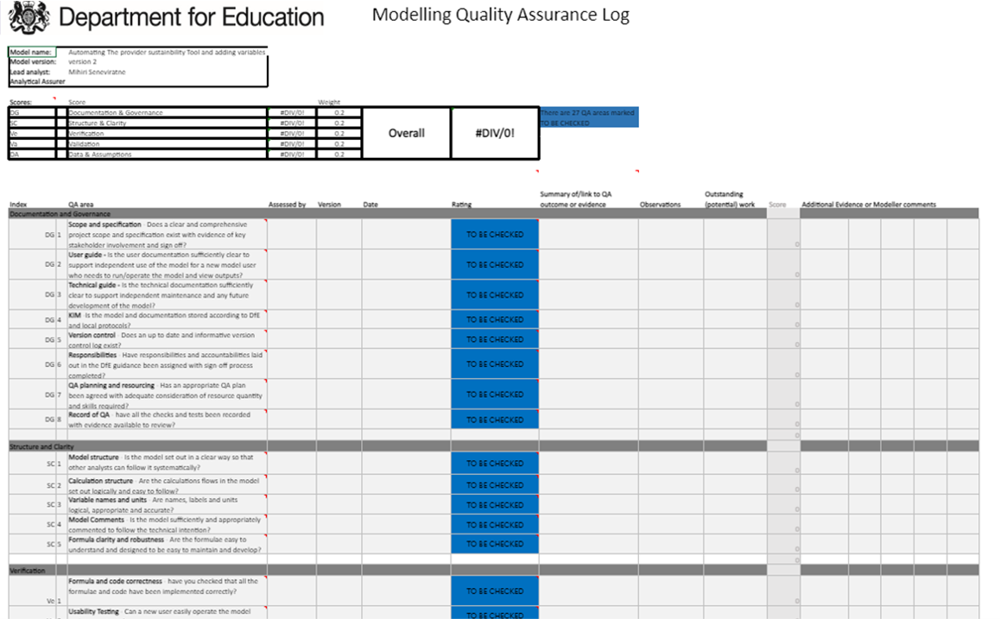

--- 
title: "How to quality assure"
author:
 - Department for Education guidance
 - The first version of this guidance was written by Thomas Morley, with help from Melissa Cook, James McGlade and Nicky Brassington. It is intended to be a living document and we'd very much welcome suggestions for improvements or additions. Please contact the Modelling Improvement and Assurance Unit. Suggestions will be reviewed by the DfE QA team, and any approved changes will be made.
date: "`r Sys.Date()`"
site: bookdown::bookdown_site
favicon: pictures/qa_logo.png
---

# Introduction

Whenever we produce a new model or a new piece of analysis, it is important to quality assure (QA) our work. This allows us to check that our analysis is credible and provides assurance to senior leaders that modelling risks are being managed appropriately.

The principles of good QA are outlined in the DfE QA framework (which can be found [here](https://educationgovuk.sharepoint.com/:w:/r/sites/sarpi/g/_layouts/15/Doc.aspx?sourcedoc=%7BE1DED116-2A85-4754-993F-A6E458DA3A59%7D&file=Quality%20Assurance%20of%20Models%20at%20DfE_April_2020.docx&action=default&mobileredirect=true)). The QA framework sets out a list of rules that one must abide by when QAing a piece of work, yet provides very few examples.

The purpose of this documentation is to provide extra examples that support the QA framework. It is important to ensure not just that our work is QA'd, but that it is QA'd **well**. The aim of this documentation is to provide guidance on how to ensure that the QA being carried out is being done properly in order to provide an accurate picture of the reliability of analysis. It is aimed at both quality assurers (teaching a QAer how to properly QA a piece of work) and at original code/model authors (teaching an analyst best practice that will allow a piece of work to be QA'd easily).

By necessity, this guidance isn't comprehensive. QA takes different forms depending on the work that is being carried out. If you are still unsure on how to carry out good QA in your area, contact your [QA officer](https://educationgovuk.sharepoint.com/sites/sarpi/g/SitePages/QA-Officers'N.aspx)).

Before discussing 'good' QA, it is useful to think about what it means for QA to be 'bad'.

## What does 'bad' QA look like?

There are many examples where QA is not up to scratch despite following the QA guidance. Here are a few of these examples:

* The QA is rushed at the last minute. This could be due to the urgency of the project, or pressure from senior leaders or clients, but this can lead to mistakes in the QA or 'cutting corners'. Always ensure that an appropriate amount of time is allocated for QA. This amount of time will often depend on the scale of the project, and the type of analysis that is done.

* Parts of the analysis are *assumed* to be 'right'. Even if results look correct, it is important to properly check the analysis that has been done. Just because something looks 'right' doesn't mean that it is!

* The QAer doesn't ask any 'real' questions about **why** things have been done the way they were.
  + If a QAer says 'everything is perfect' and raises no concerns or doesn't ask any questions at all, this may suggest that they haven't actually undertaken robust QA.
  + Similarly, if someone says that they understand something very complex the first time around, they probably don't understand it. This may be a case of the work being too complex that they struggle to put into words exactly what they don't understand. It may be worth explaining complex pieces of work a couple of times anyway, to ensure that everything has been properly understood.
  + Asking questions can build understanding, and we encourage all QAers to ask questions (even very simple ones!)

* Assuming that things are right because the 'data' or 'the software' says so. Always avoid a 'computer says yes' attitude. Just because a computer doesn't pick up on any errors doesn't mean that the analysis is completely free from mistakes!

* QAers being afraid or nervous about raising concerns. This may be more of a problem when QAing for senior analysts. QA is a vital part of every project, and QAers should be made to feel that they are able to voice concerns whenever they arise. It is important to talk through each of these concerns rather that simply disregarding them.

* Confusion around what QA is needed and what QA has been done. This will be addressed within this document. An up-to-date QA log should be kept at all times to assist with keeping track of QA that has been done, and help highlight where QA is still required. A QA log template is available on the [DfE Quality Assurance page](https://educationgovuk.sharepoint.com/sites/sarpi/g/SitePages/Quality-Assurance.aspx)

